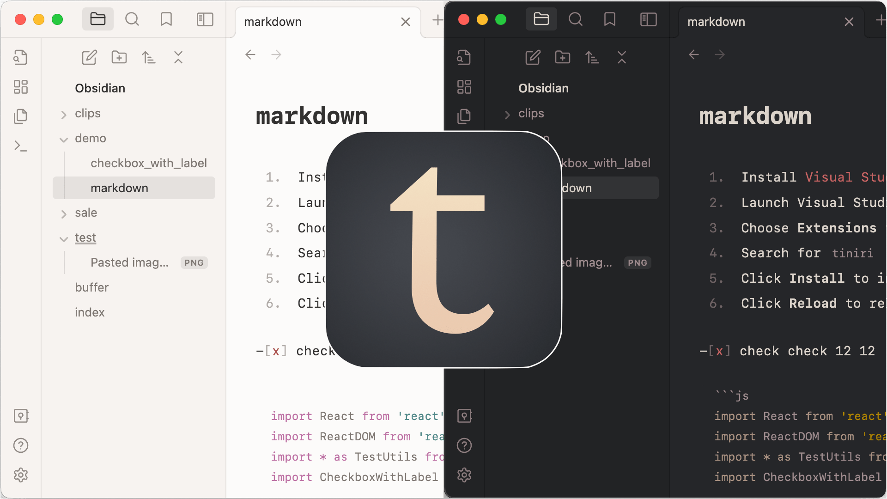

## Tiniri Obsidian theme

Part of Tiniri set. Download other themes and wallpapers:

[tiniri.vlad.studio](https://tiniri.vlad.studio/)

---

To install:

- open Obsidian
- open Settings
- select Appearance, click Manage button next to Themes
- type `Tiniri` in the filter
- enjoy :-)